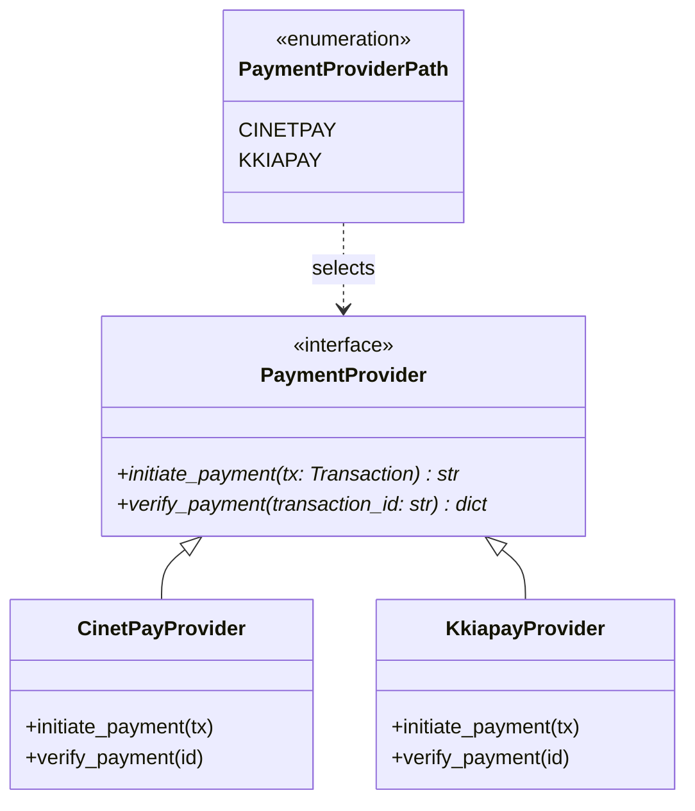

# paygate-africa

<p align="center">
  <em>Module Python d'abstraction des passerelles de paiement africaines — Sans dépendances.</em>
</p>

Il fournit une interface unifiée pour intégrer plusieurs fournisseurs sans coupler le reste de l'application à un SDK tiers.

<div class="grid cards" markdown>

-   :material-clock-fast: __Performance Ultra-Légère__

    Zéro dépendance, moins de 50KB. Utilise uniquement la bibliothèque standard Python (`urllib`, `asyncio`).

-   :material-shield-check: __Sécurisé par Design__

    Aucun stockage de secrets en base. Validation stricte via les Protocols Python (PEP 544).

-   :material-refresh: __Interface Unifiée__

    Une seule interface, quel que soit le moyen de paiement (Mobile Money, Carte, etc.).

-   :material-language-python: __Async-First__

    Conçu pour s'intégrer nativement avec FastAPI ou tout environnement asynchrone moderne.

</div>

---

## Providers supportés

| Provider | Mécanisme | Statut |
|---|---|---|
| **CinetPay** | Redirection vers page de paiement hébergée | ✅ Disponible |
| **Kkiapay** | Widget frontend + vérification API | ✅ Disponible |

---

## Aperçu rapide

```python
from paygate_africa.factory import PaymentProviderPath, select_provider

# 1. Sélectionner le provider (CINETPAY ou KKIAPAY)
provider = select_provider(PaymentProviderPath.CINETPAY)

# 2. Initier un paiement
url = await provider.initiate_payment(transaction)

# 3. Vérifier le statut
result = await provider.verify_payment(transaction.id)
# {"status": "SUCCESS", "raw_data": {...}}
```

---

## Architecture



---

## Structure du projet

```text
paygate_africa/
├── base.py          # Contrat abstrait (ABC) + Protocol Transaction
├── factory.py       # Chargement dynamique des providers
├── cinetpay/        # Implémentation CinetPay
└── kkiapay/         # Implémentation Kkiapay
```

Consulte le [Guide de démarrage](guide/getting-started.md) pour commencer.
