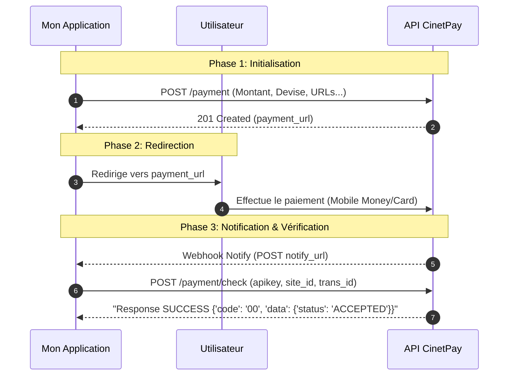

# CinetPay

[CinetPay](https://cinetpay.com) est une passerelle de paiement panafricaine supportant Mobile Money, cartes bancaires et plus.

## Fonctionnement

`initiate_payment` appelle l'API CinetPay pour créer une transaction et retourne l'URL hébergée vers laquelle rediriger l'utilisateur.

`verify_payment` appelle le endpoint `/payment/check` pour confirmer le statut.

## Variables d'environnement

| Variable | Requis | Description |
|---|---|---|
| `CINETPAY_API_KEY` | ✅ | Clé API CinetPay |
| `CINETPAY_SITE_ID` | ✅ | Identifiant du site |
| `CINETPAY_SECRET_KEY` | ✅ | Clé secrète |
| `CINETPAY_BASE_URL` | ✅ | URL de base (ex: `https://api-checkout.cinetpay.com/v2/`) |
| `SITE_URL` | ❌ | URL publique (défaut : `http://localhost:8080`) |

## URLs auto-construites

| URL | Valeur |
|---|---|
| `notify_url` | `{SITE_URL}/webhooks/cinetpay` |
| `return_url` | `{SITE_URL}/payment/success` |

## Codes de réponse

| Code | Signification |
|---|---|
| `201` | Transaction créée — `payment_url` disponible |
| `00` | Paiement accepté (vérification) |
| `ACCEPTED` | Statut confirmé (champ `data.status`) |

!!! tip "Mode DEBUG"
    En mode `DEBUG=true`, un diagnostic réseau (résolution DNS + connexion TCP port 443) est effectué avant chaque appel, visible dans les logs.
