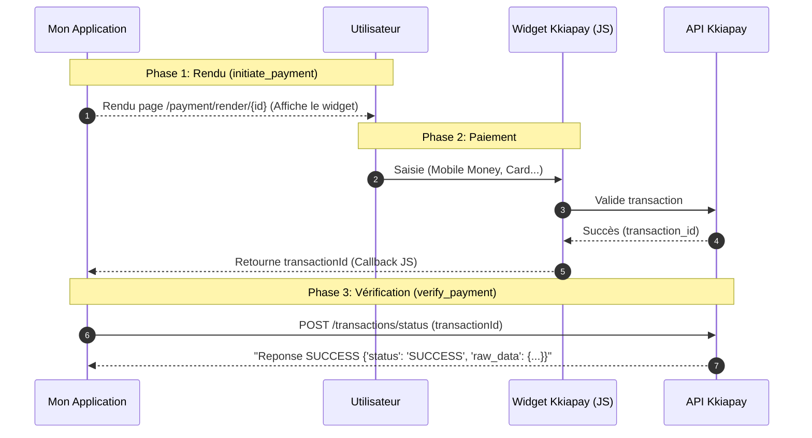

# Kkiapay

[Kkiapay](https://kkiapay.me) est une passerelle de paiement Mobile Money (MTN, Moov, Wave…) populaire en Afrique de l'Ouest.

## Fonctionnement

Kkiapay repose sur un **widget frontend** pour collecter le paiement.
`initiate_payment` retourne simplement une URL de rendu interne.
C'est le widget qui retourne un `transactionId`, utilisé ensuite pour la vérification.

`verify_payment` appelle l'API Kkiapay avec le `transactionId` retourné par le widget.

## Variables d'environnement

| Variable | Requis | Défaut |
|---|---|---|
| `KKIAPAY_PUBLIC_KEY` | ✅ | — |
| `KKIAPAY_PRIVATE_KEY` | ✅ | — |
| `KKIAPAY_SECRET_KEY` | ✅ | — |
| `KKIAPAY_URL` | ❌ | `https://api.kkiapay.me` |
| `KKIAPAY_SANDBOX_URL` | ❌ | `https://api-sandbox.kkiapay.me` |
| `KKIAPAY_TRANSACTION_STATUS_URL` | ❌ | `/api/v1/transactions/status` |
| `KKIAPAY_SANDBOX` | ❌ | `true` |
| `KKIAPAY_RENDER_URL_TEMPLATE` | ❌ | `/payment/render/{id}` |

!!! warning "Sandbox activé par défaut"
    `KKIAPAY_SANDBOX=true` par défaut — pense à passer à `false` en production.

## Normalisation des statuts

| Statut Kkiapay | Statut normalisé |
|---|---|
| `SUCCESS`, `COMPLETE`, `COMPLETED` | `SUCCESS` |
| `PENDING`, `INITIATED` | `PENDING` |
| Tout autre | `FAILED` |
