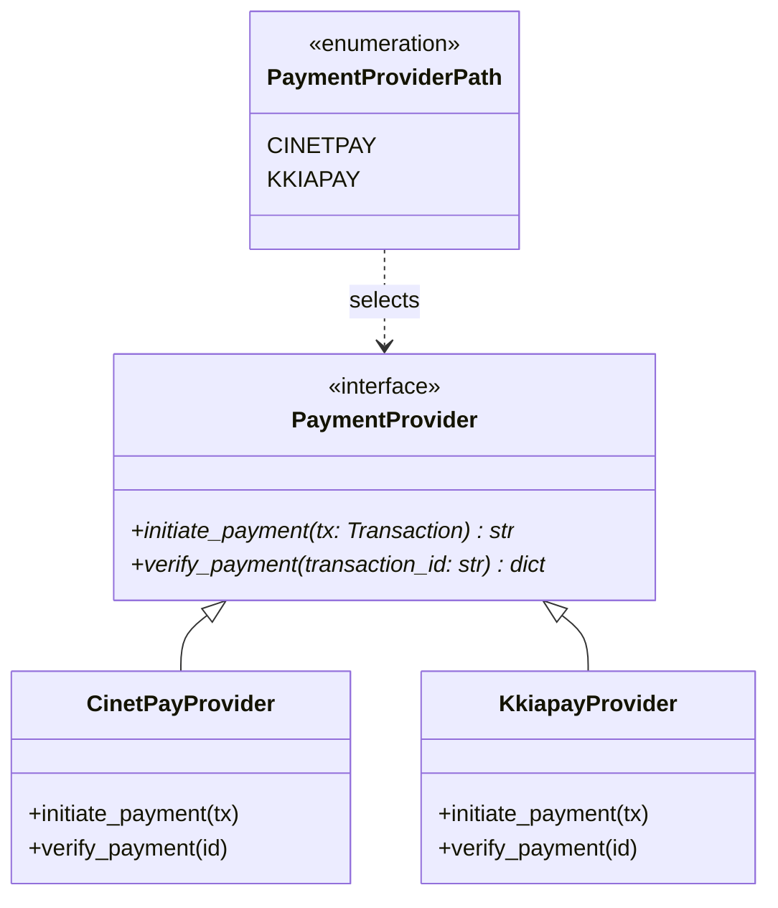

# paygate

Module Python d'abstraction des passerelles de paiement.

Il fournit une interface unifiée pour intégrer plusieurs fournisseurs sans coupler le reste de l'application à un SDK tiers.

!!! success "Zéro dépendance externe"
    Uniquement la bibliothèque standard Python — `urllib`, `asyncio`, `os`, `json`.

---

## Providers supportés

| Provider | Mécanisme | Statut |
|---|---|---|
| **CinetPay** | Redirection vers page de paiement hébergée | ✅ Disponible |
| **Kkiapay** | Widget frontend + vérification API | ✅ Disponible |

---

## Aperçu rapide

```python
from paygate.factory import PaymentProviderPath, select_provider

provider = select_provider(PaymentProviderPath.CINETPAY)
url = await provider.initiate_payment(tx)

result = await provider.verify_payment(tx.id)
# {"status": "SUCCESS", "raw_data": {...}}
```

---

## Architecture



```
paygate/
├── base.py          # Contrat abstrait (ABC) + Protocol Transaction
├── factory.py       # Chargement dynamique des providers
├── cinetpay/        # Implémentation CinetPay
└── kkiapay/         # Implémentation Kkiapay
```

Consulte le [Guide de démarrage](guide/getting-started.md) pour commencer.
